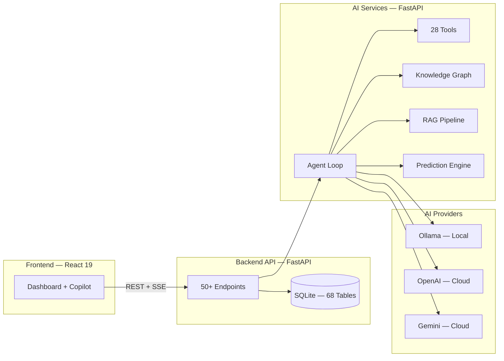

<div align="center">


# CrimeMatrix

### KSP Crime Intelligence Copilot

[](https://hack2skill.com/event/datathon2026)
[](LICENSE)


</div>

---

> **An AI Investigation Copilot that transforms how Karnataka State Police investigates crimes.**

Built for [Datathon 2026](https://hack2skill.com/event/datathon2026), CrimeMatrix addresses the KSP problem statement: **Conversational AI, Analytics, and Predictive Policing** for law enforcement.

We went beyond the requirements by building an **AI Investigation Partner** — not just a chatbot, but a system that proactively assists officers through the entire investigation lifecycle.

---

## The Problem

Karnataka State Police processes **200,000+ FIRs annually** across 31 districts. Officers face challenges that no existing system solves:

| Challenge | Reality |
|-----------|---------|
| **Fragmented Identities** | Same suspect appears as "Raj" in Bengaluru, "Rajesh" in Mysuru, "Rajendra" in Mangaluru |
| **Language Barrier** | Officers type in Kanglish: *"Bellary suspect ge phone match check madi"* |
| **Reactive Intelligence** | Patterns are spotted after crimes, not before |
| **Black-Box AI** | Officers need to know *why* AI recommends action |
| **Disconnected Districts** | Each district maintains separate records — no cross-district intelligence |

---

## Our Approach

Most teams will build an AI chatbot over crime records. Some will add dashboards and predictive models.

**We built an AI Investigation Copilot** that proactively assists officers throughout the investigation lifecycle — from FIR registration and identity resolution to criminal network discovery, predictive intelligence, explainable reasoning, and court-ready reporting.

### Innovation Tiers

| Tier | Innovation | Impact |
|------|------------|--------|
| **Core** | Indian Identity Resolution Engine | Eliminates duplicate suspects across districts |
| **Core** | Explainable Investigation Reasoning | Transparent AI chains for every recommendation |
| **Core** | Modus Operandi Fingerprinting | Detect serial crimes without direct entity matches |
| **Core** | Whisper Alerts | Proactive intelligence — not reactive search |
| **Operational** | Kanglish & Code-Mixed AI | Real-world multilingual usability |
| **Operational** | Officer-Aware Recommendations | Actionable, workload-conscious suggestions |
| **Legal** | Court-Ready Investigation Reports | Evidence references, reasoning chains, audit trails |

---

## How It Works

CrimeMatrix is not a chatbot — it's a structured reasoning system.

```
Officer: "Show me similar robbery cases across Karnataka"
        ↓
Language Pipeline: Detect → Normalize (Kanglish/English/Kannada)
        ↓
AI Agent Loop:
  1. Planner — Decomposes query into steps
  2. Executor — Runs 28 specialized tools
  3. Context Builder — Compiles results
  4. Responder — Generates answer with reasoning chain
        ↓
Response: "Found 12 cases across 4 districts. Confidence: 87%"
```

---

## Features

| Feature | Description |
|---------|-------------|
| **AI Copilot** | Natural language investigation assistant with multi-turn context |
| **Identity Resolution** | Phonetic matching, 28+ nickname mappings, Kannada transliteration |
| **Knowledge Graph** | Criminal network analysis across 68 interconnected data models |
| **Predictive Analytics** | Crime forecasting, hotspot detection, risk scoring |
| **Explainable AI** | Every recommendation includes reasoning chain and confidence score |
| **Kanglish Support** | Understands mixed Kannada-English queries naturally |
| **Whisper Alerts** | Proactive cross-district intelligence matching |
| **Court-Ready Reports** | Investigation reports with evidence references and audit trails |

---

## Impact

| Metric | Value |
|--------|-------|
| FIRs Processed Annually | 200,000+ |
| Districts Covered | 31 |
| Database Models | 68 |
| AI Tools | 28 |
| API Endpoints | 120+ |
| Tests Passing | 87 |

---

## Quick Start

```bash
git clone https://github.com/your-org/CrimeMatrix.git
cd CrimeMatrix
docker compose up
```

> **5 minutes to running** — Access at `http://localhost:5173`

<details>
<summary>Manual setup</summary>

```bash
# Backend
cd backend && python -m venv venv && source venv/bin/activate
pip install -r requirements.txt && python seed_crimes.py
uvicorn main:app --port 8000

# AI Services
cd ai-services && python -m venv venv && source venv/bin/activate
pip install -r requirements.txt
uvicorn main:app --port 8002

# Frontend
cd frontend && npm install && npm run dev
```

</details>

---

## Architecture



Three independent services — deployable separately, scalable independently. See [Architecture Docs](docs/ARCHITECTURE.md) for details.

---

## Built With

| Layer | Technology | Why |
|-------|-----------|-----|
| **Frontend** | React 19, Tailwind 4, Vite 8 | Modern, fast, component-based UI |
| **Backend** | FastAPI, SQLAlchemy 2.0, SQLite | Async performance, zero-config database |
| **AI Engine** | Ollama (local), OpenAI, Gemini | Offline-first with cloud fallback |
| **Vector Search** | FAISS | Fast semantic document retrieval |
| **Knowledge Graph** | NetworkX | Python-native graph analysis |
| **NLP** | sentence-transformers | Domain-specific embeddings |

---

## API

Two REST APIs with interactive documentation:

| Service | URL | Endpoints |
|---------|-----|-----------|
| Backend API | `localhost:8000/docs` | 50+ crime data, investigations, search |
| AI Services | `localhost:8002/docs` | 70+ AI reasoning, RAG, predictions |

---

## Contributing

Contributions are welcome! Here's how:

1. **Fork** the repository
2. **Create** a feature branch (`git checkout -b feature/amazing-feature`)
3. **Commit** your changes (`git commit -m 'Add amazing feature'`)
4. **Push** to the branch (`git push origin feature/amazing-feature`)
5. **Open** a Pull Request

See [CONTRIBUTING.md](CONTRIBUTING.md) for detailed guidelines.

---

## Acknowledgments

Built with the incredible work of the open source community:

- [FastAPI](https://fastapi.tiangolo.com/) — Modern Python web framework
- [React](https://react.dev/) — UI library
- [Ollama](https://ollama.ai/) — Local LLM inference
- [FAISS](https://github.com/facebookresearch/faiss) — Vector similarity search
- [NetworkX](https://networkx.org/) — Graph analysis
- [Tailwind CSS](https://tailwindcss.com/) — Utility-first CSS

---

## License

[MIT](LICENSE)

---

<div align="center">

**Built for [Datathon 2026](https://hack2skill.com/event/datathon2026) by [Hack2Skill](https://hack2skill.com)**

*Transforming law enforcement with AI-powered investigation intelligence*

**If you find this useful, give it a star. It helps others discover it.**

</div>
