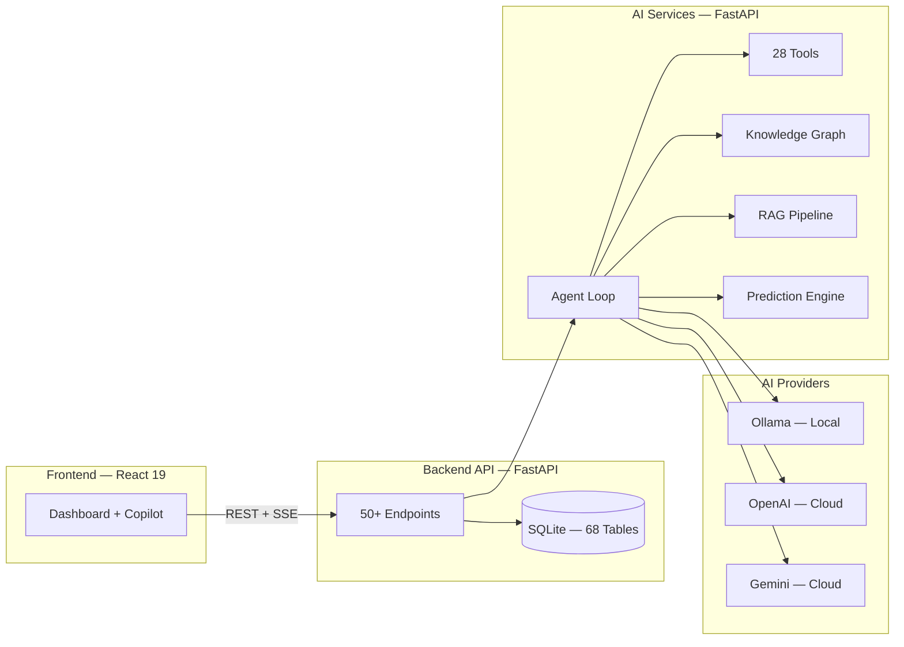

<div align="center">


# CrimeMatrix

**AI Investigation Copilot for Karnataka State Police**

[](LICENSE)


</div>

---

> **Built for the officers who protect Karnataka's 70 million citizens.**

CrimeMatrix is an AI-powered crime intelligence platform that transforms how law enforcement officers investigate crimes, identify suspects, and uncover criminal networks across Karnataka's 31 districts.

It handles **200,000+ FIRs annually** — resolving fragmented identities, connecting cross-district cases, and delivering explainable AI recommendations with reasoning chains.

---

## Why CrimeMatrix?

Law enforcement in Karnataka faces real challenges that technology can solve:

- **Same person, different names** — "Raj" in Bengaluru, "Rajesh" in Mysuru, "Rajendra" in Mangaluru. Without identity resolution, criminals slip through jurisdictional cracks.

- **Language barrier** — Field officers think in Kannada and type in Kanglish. Existing systems demand English-only input.

- **Reactive intelligence** — By the time patterns are spotted across districts, the damage is done. CrimeMatrix makes intelligence **proactive**.

- **Black-box AI** — When AI recommends action, officers need to know **why**. Every CrimeMatrix recommendation includes a reasoning chain.

---

## How It Works

CrimeMatrix is not a chatbot — it's a structured reasoning system that assists officers through the entire investigation lifecycle.

```
Officer asks: "Show me similar robbery cases across Karnataka"
        ↓
Language Pipeline: Detect → Normalize (Kanglish/English/Kannada)
        ↓
AI Agent Loop:
  1. Planner — Decomposes query into steps
  2. Executor — Runs 28 specialized tools
  3. Context Builder — Compiles results
  4. Responder — Generates answer with reasoning chain
        ↓
Response: "Found 12 cases across 4 districts. Confidence: 87%"
```

---

## Features

| | Feature | Description |
|---|---------|-------------|
| | **AI Copilot** | Natural language investigation assistant with multi-turn context |
| | **Identity Resolution** | Phonetic matching, 28+ nickname mappings, Kannada transliteration |
| | **Knowledge Graph** | Criminal network analysis across 68 interconnected data models |
| | **Predictive Analytics** | Crime forecasting, hotspot detection, risk scoring |
| | **Explainable AI** | Every recommendation includes reasoning chain and confidence score |
| | **Kanglish Support** | Understands "Bellary suspect ge phone match check madi" naturally |
| | **Whisper Alerts** | Proactive cross-district intelligence matching as new FIRs arrive |
| | **Court-Ready Reports** | Investigation reports with evidence references and audit trails |

---

## Quick Start

```bash
git clone https://github.com/your-org/CrimeMatrix.git
cd CrimeMatrix
docker compose up
```

> **5 minutes to running** — Access at `http://localhost:5173`

<details>
<summary>Manual setup</summary>

```bash
# Backend
cd backend && python -m venv venv && source venv/bin/activate
pip install -r requirements.txt && python seed_crimes.py
uvicorn main:app --port 8000

# AI Services
cd ai-services && python -m venv venv && source venv/bin/activate
pip install -r requirements.txt
uvicorn main:app --port 8002

# Frontend
cd frontend && npm install && npm run dev
```

</details>

---

## Architecture



Three independent services — deployable separately, scalable independently. See [Architecture Docs](docs/ARCHITECTURE.md) for details.

---

## Built With

| Layer | Technology | Why |
|-------|-----------|-----|
| **Frontend** | React 19, Tailwind 4, Vite 8 | Modern, fast, component-based UI |
| **Backend** | FastAPI, SQLAlchemy 2.0, SQLite | Async performance, zero-config database |
| **AI Engine** | Ollama (local), OpenAI, Gemini | Offline-first with cloud fallback |
| **Vector Search** | FAISS | Fast semantic document retrieval |
| **Knowledge Graph** | NetworkX | Python-native graph analysis |
| **NLP** | sentence-transformers | Domain-specific embeddings |

---

## API

Two REST APIs with interactive documentation:

| Service | URL | Endpoints |
|---------|-----|-----------|
| Backend API | `localhost:8000/docs` | 50+ crime data, investigations, search |
| AI Services | `localhost:8002/docs` | 70+ AI reasoning, RAG, predictions |

---

## Contributing

Contributions are welcome! Here's how:

1. **Fork** the repository
2. **Create** a feature branch (`git checkout -b feature/amazing-feature`)
3. **Commit** your changes (`git commit -m 'Add amazing feature'`)
4. **Push** to the branch (`git push origin feature/amazing-feature`)
5. **Open** a Pull Request

See [CONTRIBUTING.md](CONTRIBUTING.md) for detailed guidelines.

---

## Community

- [GitHub Issues](https://github.com/your-org/CrimeMatrix/issues) — Bug reports & feature requests
- [Contributing Guide](CONTRIBUTING.md) — How to contribute
- [Security Policy](SECURITY.md) — Vulnerability reporting

---

## Acknowledgments

Built with the incredible work of the open source community:

- [FastAPI](https://fastapi.tiangolo.com/) — Modern Python web framework
- [React](https://react.dev/) — UI library
- [Ollama](https://ollama.ai/) — Local LLM inference
- [FAISS](https://github.com/facebookresearch/faiss) — Vector similarity search
- [NetworkX](https://networkx.org/) — Graph analysis
- [Tailwind CSS](https://tailwindcss.com/) — Utility-first CSS

Inspired by the real challenges faced by law enforcement in Karnataka.

---

## License

[MIT](LICENSE)

---

<div align="center">

**If you find this useful, give it a star. It helps others discover it.**

</div>
