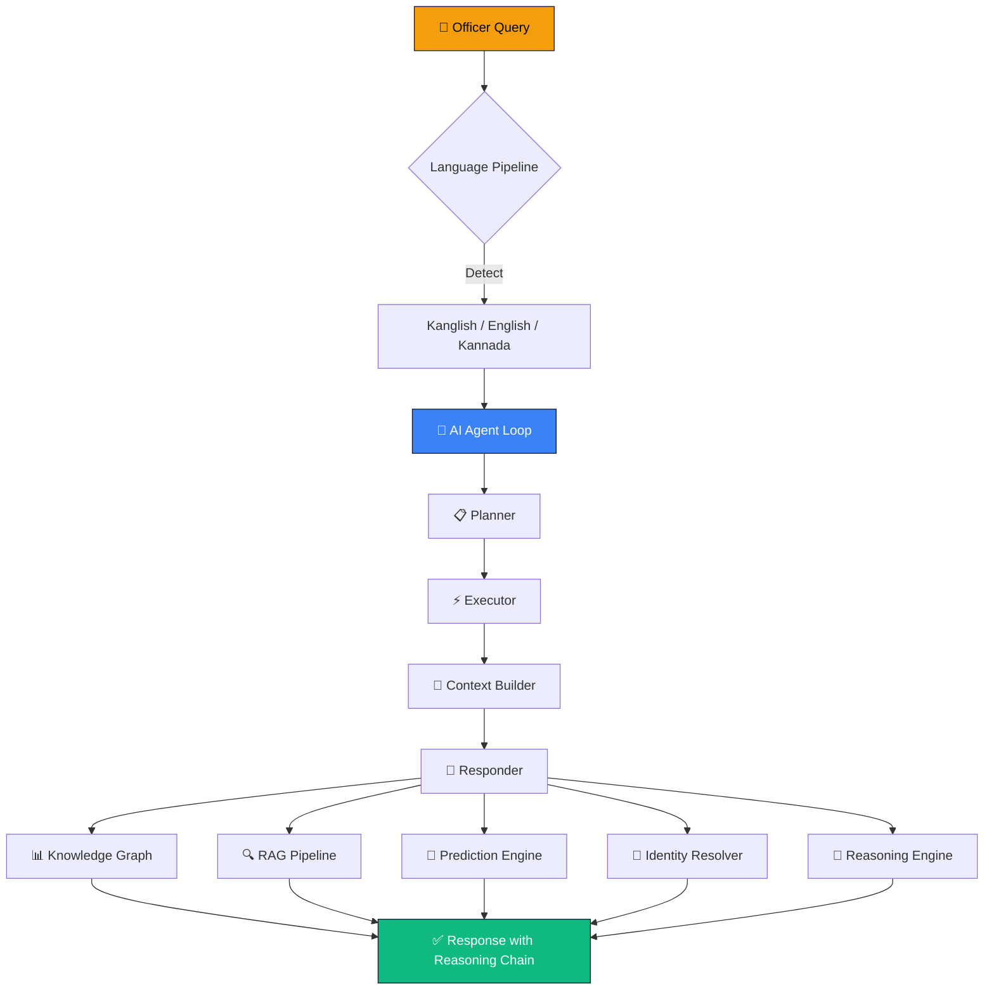
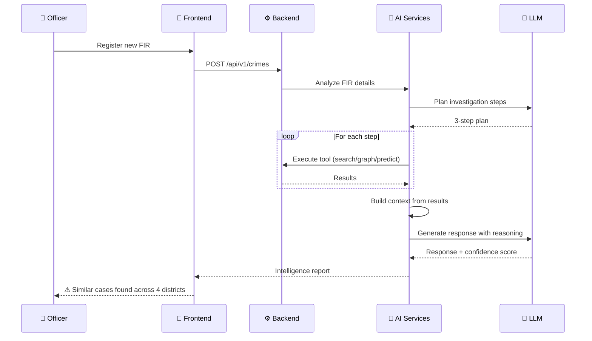
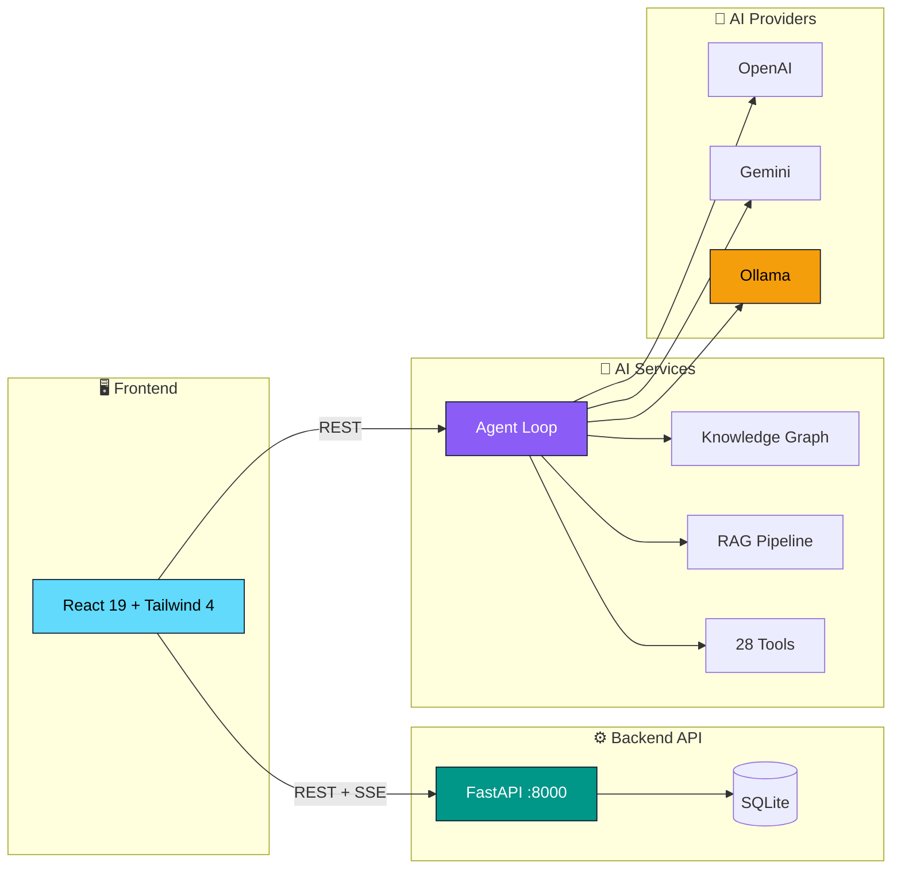

<div align="center">

# 🔍 CrimeMatrix

### AI Investigation Copilot for Karnataka State Police

**An intelligent crime investigation platform that transforms how law enforcement officers investigate crimes, identify suspects, and uncover criminal networks across Karnataka's 31 districts.**

<br>


<br>


</div>

---

## 🎯 The Problem

> **Karnataka State Police processes 200,000+ FIRs annually across 31 districts.**
> Officers face challenges that no spreadsheet or basic database can solve.

<table>
<tr>
<td width="50%" valign="top">

### 🔗 Fragmented Identities
The same suspect appears as **"Raj"** in Bengaluru, **"Rajesh"** in Mysuru, and **"Rajendra"** in Mangaluru. Without identity resolution, criminals slip through jurisdictional cracks.

</td>
<td width="50%" valign="top">

### 🗣️ Language Barrier
Field officers think in Kannada. They type in Kanglish: *"Bellary suspect ge phone match check madi"*. Existing systems demand English-only input.

</td>
</tr>
<tr>
<td width="50%" valign="top">

### ⚡ Reactive Intelligence
By the time patterns are spotted — a serial burglar targeting jewelry stores across three districts — the damage is done. Intelligence arrives **after** crimes, not before.

</td>
<td width="50%" valign="top">

### 🔒 Black-Box AI
When AI recommends "investigate Suspect A," officers need to know **why**. A recommendation without reasoning is just noise.

</td>
</tr>
<tr>
<td colspan="2" align="center">

### 🌐 Disconnected Investigations
Each district maintains its own records. A robbery in Bengaluru and a similar MO in Mysuru **never connect** unless someone manually calls across districts.

</td>
</tr>
</table>

---

## ⚡ How CrimeMatrix Solves This

CrimeMatrix is an **AI Investigation Copilot** — not a chatbot, but a structured reasoning system that assists officers through the entire investigation lifecycle.



### 🔍 Investigation Workflow

When an officer registers a new FIR, CrimeMatrix **proactively** surfaces intelligence:



---

## 🧠 Architecture

Three independent services, each with a clear responsibility:



### 🏗️ Design Philosophy

| Principle | Implementation |
|-----------|----------------|
| **Plan → Execute → Respond** | Deterministic tool execution — no hallucinated tool calls |
| **Identity-First** | Resolve "who" before answering "what" |
| **Proactive Intelligence** | Whisper Alerts — not just search |
| **Explainable AI** | Every recommendation has a reasoning chain |

See [docs/DESIGN-DECISIONS.md](docs/DESIGN-DECISIONS.md) for detailed rationale.

---

## ✨ Features

<table>
<tr>
<td width="33%" valign="top">

### 🤖 AI Intelligence
- Conversational AI Copilot
- Multi-language (EN/KN/Kanglish)
- Voice Assistant (STT/TTS)
- Multi-turn Context
- Investigation Workflows

</td>
<td width="33%" valign="top">

### 🔍 Investigation
- Semantic Crime Search
- Cross-District Matching
- Similar Case Discovery
- Investigation Workspace
- Saved Bookmarks

</td>
<td width="34%" valign="top">

### 📊 Analytics
- Crime Pattern Discovery
- Hotspot Detection
- Trend Analysis
- Geospatial Maps
- Criminal Timeline

</td>
</tr>
<tr>
<td width="33%" valign="top">

### 🎯 Prediction
- Crime Forecasting
- Early Warning Alerts
- Risk Scoring
- Case Prioritization
- Recidivism Prediction

</td>
<td width="33%" valign="top">

### 🧠 Intelligence
- Knowledge Graph
- Criminal Network Analysis
- MO Fingerprinting
- Behavioral Profiling
- Entity Relationship Map

</td>
<td width="34%" valign="top">

### 🔒 Explainability
- Reasoning Chains
- Confidence Scores
- Source Attribution
- Audit Trail
- Court-Ready Reports

</td>
</tr>
</table>

---

## 🛠️ Tech Stack

<table>
<tr>
<td><strong>Frontend</strong></td>
<td>


</td>
</tr>
<tr>
<td><strong>Backend</strong></td>
<td>


</td>
</tr>
<tr>
<td><strong>AI/ML</strong></td>
<td>


</td>
</tr>
<tr>
<td><strong>DevOps</strong></td>
<td>


</td>
</tr>
</table>

---

## 🚀 Quick Start

### Prerequisites

- Python 3.11+
- Node.js 18+
- [Ollama](https://ollama.ai/) (for local AI inference)

### Option A: Docker Compose (Recommended)

```bash
git clone https://github.com/your-org/CrimeMatrix.git
cd CrimeMatrix
docker compose up
```

> **⏱️ 5 minutes to running** — Access at `http://localhost:5173`

### Option B: Manual Setup

```bash
# 1. Backend
cd backend
python -m venv venv && source venv/bin/activate
pip install -r requirements.txt
cp .env.example .env
python seed_crimes.py
uvicorn main:app --port 8000

# 2. AI Services (new terminal)
cd ai-services
python -m venv venv && source venv/bin/activate
pip install -r requirements.txt
uvicorn main:app --port 8002

# 3. Frontend (new terminal)
cd frontend
npm install
npm run dev
```

### Option C: Makefile

```bash
make setup    # Install all dependencies
make seed     # Seed database with demo data
make dev      # Start all services
```

See [docs/DEPLOYMENT.md](docs/DEPLOYMENT.md) for detailed instructions.

---

## 📊 Project Metrics

<table>
<tr align="center">
<td width="16%"><strong>68</strong><br/>Database Models</td>
<td width="16%"><strong>28</strong><br/>AI Tools</td>
<td width="16%"><strong>120+</strong><br/>API Endpoints</td>
<td width="16%"><strong>87</strong><br/>Tests Passing</td>
<td width="16%"><strong>46+</strong><br/>UI Components</td>
<td width="16%"><strong>3</strong><br/>LLM Providers</td>
</tr>
</table>

---

## 📁 Project Structure

```
CrimeMatrix/
├── 🖥️ frontend/              # React SPA — 46+ components
│   ├── src/components/       #   Dashboard, Copilot, Graph, Maps
│   └── src/services/         #   24 API service modules
│
├── ⚙️ backend/               # FastAPI — 50+ endpoints
│   ├── app/models/           #   68 SQLAlchemy models
│   ├── app/services/         #   38 business logic classes
│   ├── app/api/v1/           #   REST endpoints
│   └── alembic/              #   25 database migrations
│
├── 🧠 ai-services/           # AI Intelligence — 70+ endpoints
│   ├── agent/                #   Core agent loop
│   ├── tools/                #   28 specialized tools
│   ├── knowledge/            #   Knowledge graph builder
│   ├── reasoning/            #   Explainable reasoning engine
│   ├── prediction/           #   Crime forecasting & prediction
│   ├── identity/             #   Indian identity resolution
│   ├── language/             #   Kanglish/translation pipeline
│   └── workflows/            #   Investigation workflows
│
├── 📚 docs/                  # Documentation
│   ├── ARCHITECTURE.md       #   System design (7 Mermaid diagrams)
│   ├── DESIGN-DECISIONS.md   #   Architecture rationale
│   ├── API.md                #   Complete API reference
│   └── DEPLOYMENT.md         #   Setup guide
│
├── 🐳 docker-compose.yml     # One-command setup
├── 🔧 Makefile               # Build automation
└── 📄 README.md              # This file
```

---

## 🔌 API Overview

| Service | URL | Endpoints | Description |
|---------|-----|-----------|-------------|
| **Backend API** | `localhost:8000` | 50+ | Crime data, investigations, search, analytics |
| **AI Services** | `localhost:8002` | 70+ | AI chat, tools, RAG, identity, knowledge graph |
| **Swagger Docs** | `localhost:8000/docs` | — | Interactive API documentation |
| **AI Docs** | `localhost:8002/docs` | — | AI Services API documentation |

See [docs/API.md](docs/API.md) for the complete reference.

---

## 📚 Documentation

| Document | Description |
|----------|-------------|
| [Architecture](docs/ARCHITECTURE.md) | System design with 7 Mermaid diagrams |
| [Design Decisions](docs/DESIGN-DECISIONS.md) | Why each technology was chosen |
| [API Reference](docs/API.md) | Complete endpoint documentation |
| [Deployment](docs/DEPLOYMENT.md) | Setup guide (Docker, Manual, Makefile) |
| [Contributing](CONTRIBUTING.md) | How to contribute |
| [Security](SECURITY.md) | Security policy |

---

## 🤝 Contributing

We welcome contributions! See [CONTRIBUTING.md](CONTRIBUTING.md) for guidelines.

```bash
# Quick start
git clone https://github.com/your-org/CrimeMatrix.git
cd CrimeMatrix
make setup
make test
```

---

## 📄 License

This project is licensed under the MIT License — see [LICENSE](LICENSE) for details.

---

<div align="center">

**Built with ❤️ for Karnataka State Police**

*Transforming law enforcement with AI-powered investigation intelligence*

</div>
