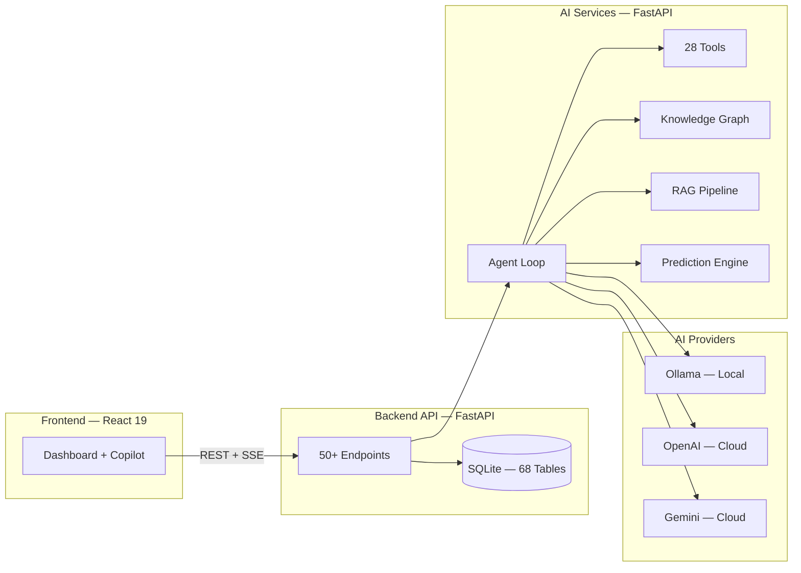

<div align="center">


# CrimeMatrix

**AI Investigation Copilot for Karnataka State Police**

[](LICENSE)


</div>

---

An intelligent crime investigation platform that transforms how law enforcement officers investigate crimes, identify suspects, and uncover criminal networks across Karnataka's 31 districts.

**Handles 200,000+ FIRs annually** — resolving fragmented identities, connecting cross-district cases, and delivering explainable AI recommendations with reasoning chains.

---

## Features

| | Feature | Description |
|---|---------|-------------|
| | **AI Copilot** | Natural language investigation assistant with multi-turn context |
| | **Identity Resolution** | Phonetic matching, 28+ nickname mappings, Kannada transliteration |
| | **Knowledge Graph** | Criminal network analysis across 68 interconnected data models |
| | **Predictive Analytics** | Crime forecasting, hotspot detection, risk scoring |
| | **Explainable AI** | Every recommendation includes reasoning chain and confidence score |
| | **Kanglish Support** | Understands "Bellary suspect ge phone match check madi" naturally |

---

## Quick Start

```bash
git clone https://github.com/your-org/CrimeMatrix.git
cd CrimeMatrix
docker compose up
```

> **5 minutes to running** — Access at `http://localhost:5173`

<details>
<summary>Manual setup</summary>

```bash
# Backend
cd backend && python -m venv venv && source venv/bin/activate
pip install -r requirements.txt && python seed_crimes.py
uvicorn main:app --port 8000

# AI Services
cd ai-services && python -m venv venv && source venv/bin/activate
pip install -r requirements.txt
uvicorn main:app --port 8002

# Frontend
cd frontend && npm install && npm run dev
```

</details>

---

## Architecture



Three independent services — deployable separately, scalable independently. See [Architecture Docs](docs/ARCHITECTURE.md) for details.

---

## Tech Stack


---

## API

Two REST APIs with interactive documentation:

| Service | URL | Endpoints |
|---------|-----|-----------|
| Backend API | `localhost:8000/docs` | 50+ crime data, investigations, search |
| AI Services | `localhost:8002/docs` | 70+ AI reasoning, RAG, predictions |

---

## Community

- [GitHub Issues](https://github.com/your-org/CrimeMatrix/issues) — Bug reports & feature requests
- [Contributing Guide](CONTRIBUTING.md) — How to contribute
- [Security Policy](SECURITY.md) — Vulnerability reporting

---

## License

[MIT](LICENSE)
