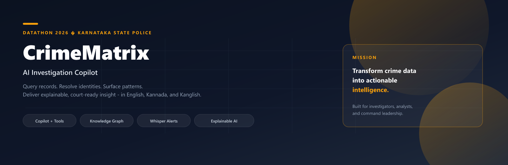
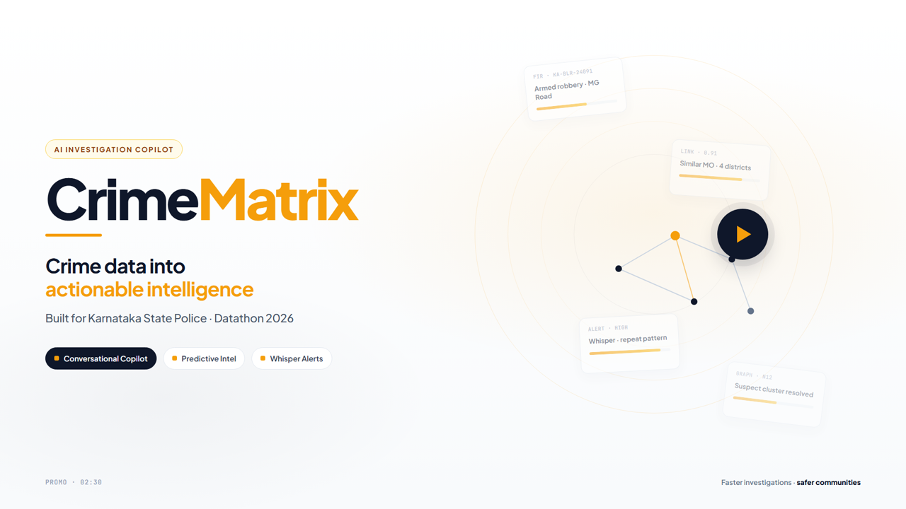
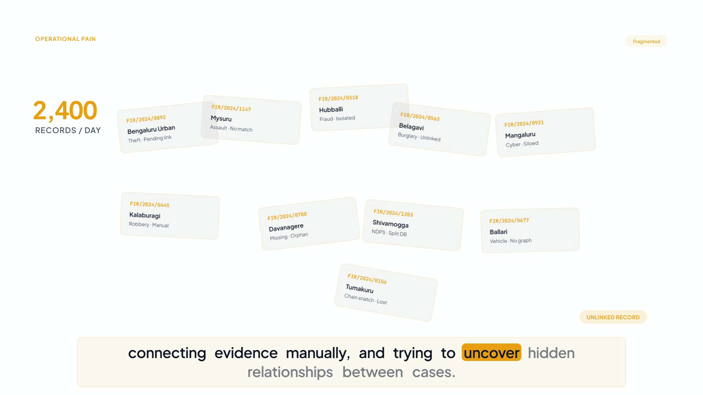
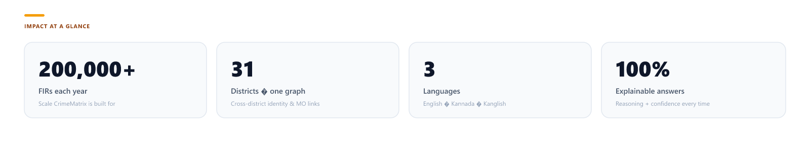
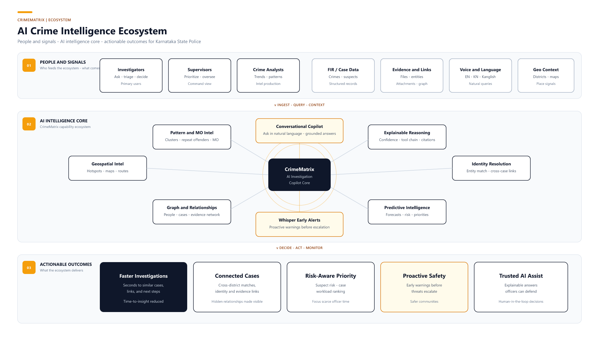
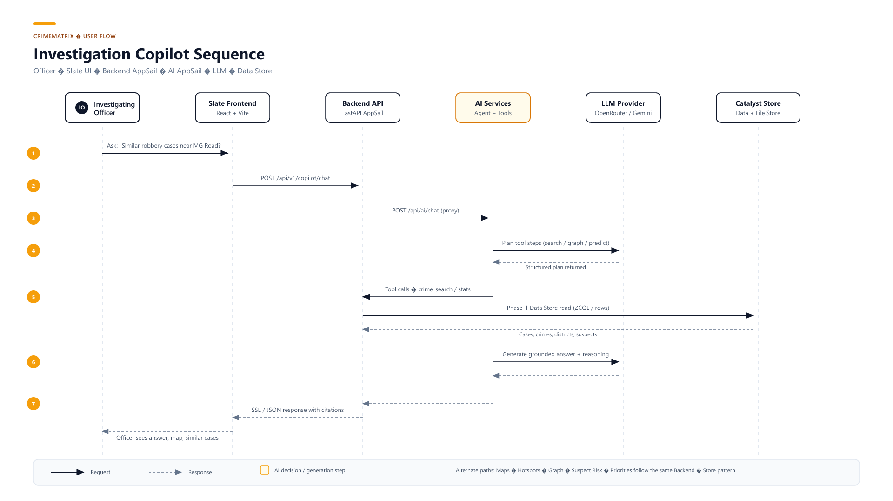
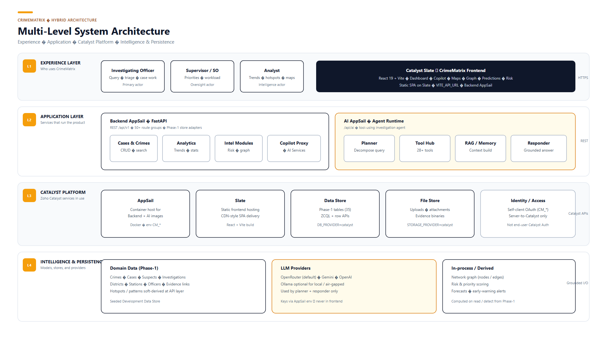
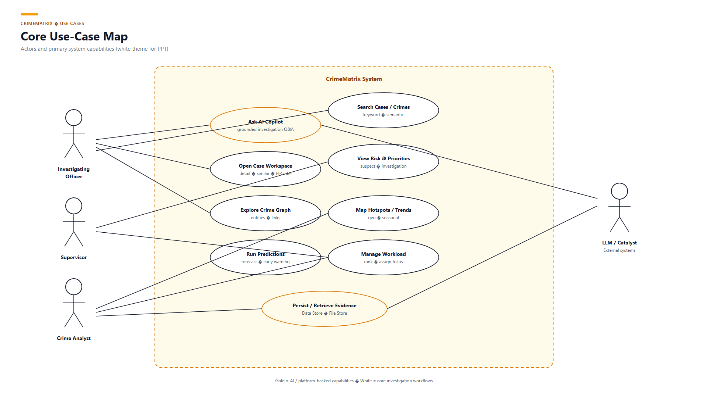

<p align="center">
  
</p>

<p align="center">
  <a href="https://hack2skill.com/event/datathon2026"></a>
  <a href="LICENSE"></a>
  
  
  
  
</p>

<p align="center">
  <a href="#watch-the-demo">Demo</a> ·
  <a href="#the-problem">Problem</a> ·
  <a href="#impact">Impact</a> ·
  <a href="#intelligence-ecosystem">Ecosystem</a> ·
  <a href="#capabilities">Capabilities</a> ·
  <a href="#investigation-flow">Flow</a> ·
  <a href="#architecture">Architecture</a> ·
  <a href="#use-cases">Use cases</a> ·
  <a href="#run-locally">Run</a> ·
  <a href="#documentation">Docs</a>
</p>

---

## Watch the demo

<p align="center">
  <a href="videos/videos/video.mp4">
    
  </a>
</p>

<p align="center">
  <a href="videos/videos/video.mp4"><strong>▶ Play full promo (~2 min)</strong></a>
  &nbsp;·&nbsp;
  Datathon 2026 product story
</p>

<details>
<summary><strong>Inline video player</strong> (supported on GitHub web)</summary>
<br/>

<video src="videos/videos/video.mp4" width="100%" controls playsinline>
  Your browser does not support the video tag.
  <a href="videos/videos/video.mp4">Download the CrimeMatrix promo</a>
</video>
</details>

> Every day, thousands of crime records are generated across Karnataka. Investigators still spend hours searching fragmented databases and connecting evidence by hand.  
> **What if AI became every investigator’s intelligent partner?**

---

## The problem

Karnataka State Police registers **200,000+ FIRs** a year across **31 districts**. The hard part is rarely finding *a* record — it is connecting the right people, places, and patterns before the next incident.

<p align="center">
  
</p>

| Friction in the field | What that costs |
|---|---|
| Same suspect, five spellings, three stations | Hours lost reconciling identities by hand |
| Queries in Kanglish, files in English / Kannada | Search that misses what the officer meant |
| Intelligence that arrives *after* a series | Reactive policing instead of early intervention |
| Black-box “AI suggestions” | Outputs officers cannot defend in court |
| District silos | Links that never leave a local folder |

CrimeMatrix is built against that reality — for [Datathon 2026](https://hack2skill.com/event/datathon2026) and the KSP brief on conversational AI, analytics, and predictive policing.

---

## Impact

<p align="center">
  
</p>

| Before CrimeMatrix | With CrimeMatrix |
|---|---|
| Keyword search across siloed station systems | Semantic search + cross-district linking |
| Manual identity reconciliation | Phonetic + multilingual identity resolution |
| Pattern discovery after a series peaks | Predictive signals and Whisper Alerts |
| “Trust the model” with no paper trail | Reasoning chain, confidence, audit-ready reports |

---

## Intelligence ecosystem

People and signals in. Grounded intelligence out. One AI core for investigators, analysts, and command.

<p align="center">
  
</p>

---

## Capabilities

Not a chatbot bolted onto a database. An investigation loop: **ask → reason → evidence → explain**.

| | Capability | In practice |
|:---:|---|---|
| **01** | **Investigation Copilot** | Multi-turn Q&A with tool use, context, and structured reasoning |
| **02** | **Identity Resolution** | Phonetic matches, nicknames, and Kannada transliteration across districts |
| **03** | **Modus Operandi Matching** | Serial links from behavioural fingerprints — not only shared names or phones |
| **04** | **Knowledge Graph** | People, cases, vehicles, phones, and locations as a navigable network |
| **05** | **Predictive Signals** | Forecasts, hotspot cues, and risk scores for proactive deployment |
| **06** | **Whisper Alerts** | Cross-district matches pushed when they matter — without a manual hunt |
| **07** | **Explainable Output** | Reasoning chain + confidence with every recommendation |
| **08** | **Court-Ready Reports** | Investigation summaries with evidence references and an audit trail |

---

## Investigation flow

From a natural-language question to a cited, defendable answer — through frontend, API, agent tools, LLM, and data store.

<p align="center">
  
</p>

**Sample exchange**

```text
Officer  ▶  Show me similar robbery cases across Karnataka
Copilot  ▶  Found 7 behavioural matches across 4 districts.
            Top link: FIR/BNG/2024/1842 ↔ FIR/MYS/2024/0911
            Shared MO: night entry · two-wheeler exit · cash-only
            Confidence: 0.86 · Reasoning attached
```

Ask in English, Kannada, or Kanglish — by text or voice. The copilot keeps investigation context and returns answers you can defend.

---

## Architecture

Four clear levels: experience → application → platform → intelligence & data.

<p align="center">
  
</p>

| Layer | Stack |
|---|---|
| **Interface** | React 19 · Vite · Tailwind CSS |
| **API & data** | FastAPI · SQLAlchemy · SQLite / Catalyst datastore |
| **Intelligence** | Agent loop · FAISS · NetworkX · sentence-transformers |
| **LLM providers** | Ollama (local default) · Gemini · OpenAI / OpenRouter |

Design rationale: [`docs/ARCHITECTURE.md`](docs/ARCHITECTURE.md) · [`docs/DESIGN-DECISIONS.md`](docs/DESIGN-DECISIONS.md) · vector sources in [`docs/diagrams/`](docs/diagrams/).

---

## Use cases

Who uses CrimeMatrix — and what the system must deliver.

<p align="center">
  
</p>

| Role | Who | What they get |
|---|---|---|
| **Investigator** | Station / IO teams | Copilot Q&A, identity links, MO matches, case timelines |
| **Analyst** | District / state intel | Graphs, trends, hotspots, semantic discovery across records |
| **Commander** | Leadership | Risk signals, Whisper Alerts, prioritised leads, audit-ready summaries |

---

## What makes it different

| Typical “AI for police” demo | CrimeMatrix |
|---|---|
| Chat wrapper over a single database | Multi-tool agent with search, graph, identity, prediction |
| English-only prompts | English · Kannada · Kanglish (text + voice) |
| Opaque rankings | Explainable answers with confidence |
| Reactive dashboards | Whisper Alerts and proactive linking |
| Pretty UI, weak ops story | Built around how KSP investigations actually run |

---

## Run locally

**Recommended:** Docker and Docker Compose.

```bash
git clone https://github.com/bhuwanb23/CrimeMatrix.git
cd CrimeMatrix
docker compose up
```

| Service | URL |
|---|---|
| Application | [http://localhost:5173](http://localhost:5173) |
| Backend API | [http://localhost:8000/docs](http://localhost:8000/docs) |
| AI Services | [http://localhost:8002/docs](http://localhost:8002/docs) |

Ollama pulls `llama3.2:1b` on first start. Optional cloud keys go in each service’s `.env`.

<details>
<summary><strong>Manual setup</strong> (without Docker)</summary>

<br/>

**Run order:** backend → seed → AI (+ Ollama) → frontend.

```bash
# 1 · Backend  —  http://localhost:8000
cd backend
python -m venv venv
source venv/bin/activate          # Windows: venv\Scripts\activate
pip install -r requirements.txt
uvicorn main:app --port 8000 --reload

# 2 · Seed + intelligence bootstrap  (API must be up)
python -m seed --fresh
python -m seed --bootstrap-only

# 3 · AI services  —  http://localhost:8002
cd ../ai-services
python -m venv venv && source venv/bin/activate
pip install -r requirements.txt
uvicorn main:app --port 8002 --reload

# 4 · Frontend  —  http://localhost:5173
cd ../frontend
npm install && npm run dev
```

For local LLMs: [install Ollama](https://ollama.com/), then `ollama pull llama3.2:1b`.  
Deployment notes: [`docs/DEPLOYMENT.md`](docs/DEPLOYMENT.md).

</details>

---

## Repository map

```text
CrimeMatrix/
├── frontend/          # React 19 investigation UI (Slate)
├── backend/           # FastAPI · crimes, graph, analytics, seed
├── ai-services/       # Agent · RAG · tools · copilot
├── docs/
│   ├── diagrams/      # Architecture & flow SVGs + PNGs
│   └── assets/        # README hero, impact, promo art
└── videos/            # Datathon promo
```

---

## Documentation

| Document | What’s inside |
|---|---|
| [`docs/ARCHITECTURE.md`](docs/ARCHITECTURE.md) | System design, agent loop, data flow |
| [`docs/DESIGN-DECISIONS.md`](docs/DESIGN-DECISIONS.md) | Why each major choice was made |
| [`docs/DEPLOYMENT.md`](docs/DEPLOYMENT.md) | Environments, configuration, ops checklist |
| [`docs/API.md`](docs/API.md) | REST surfaces (Swagger-backed) |
| [`docs/diagrams/`](docs/diagrams/) | PPT / README diagrams (SVG + PNG) |
| [`videos/videos/video.mp4`](videos/videos/video.mp4) | Full product promo |
| [`CONTRIBUTING.md`](CONTRIBUTING.md) | How to contribute |
| [`SECURITY.md`](SECURITY.md) | How to report vulnerabilities |

**Regenerate diagram PNGs from SVG** (optional):

```bash
cd docs/scripts
npm install
node render-diagrams.mjs
```

---

## License

Released under the [MIT License](LICENSE).

Built for **[Datathon 2026](https://hack2skill.com/event/datathon2026)** — conversational AI, analytics, and predictive policing for Karnataka State Police.

<p align="center">
  <strong>CrimeMatrix</strong> — Transforming crime data into actionable intelligence.
</p>
