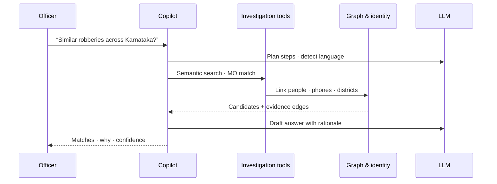
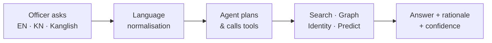
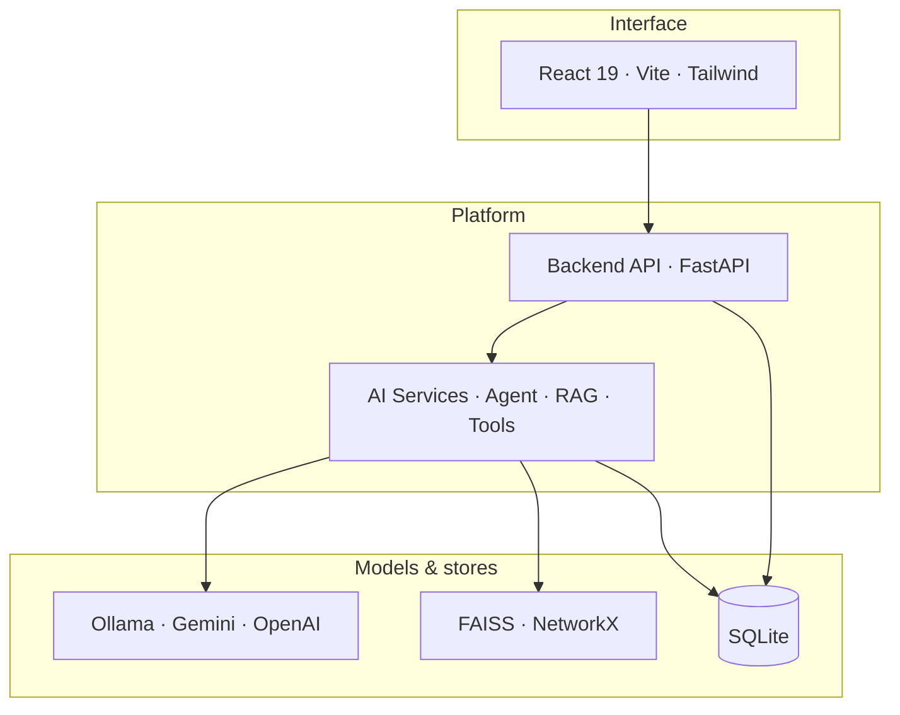

<p align="center">
  
</p>

<h1 align="center">CrimeMatrix</h1>

<p align="center">
  <strong>AI Investigation Copilot for Karnataka State Police</strong><br/>
  Query records. Resolve identities. Surface patterns. Deliver explainable, court-ready insight —
  in English, Kannada, and Kanglish.
</p>

<p align="center">
  <em>Transforming crime data into actionable intelligence.</em>
</p>

<p align="center">
  <a href="https://hack2skill.com/event/datathon2026"></a>
  <a href="LICENSE"></a>
  
  
  
</p>

<p align="center">
  <a href="#watch-the-demo">Demo</a> ·
  <a href="#why-it-exists">Why</a> ·
  <a href="#impact-at-a-glance">Impact</a> ·
  <a href="#what-officers-can-do">Capabilities</a> ·
  <a href="#a-day-with-crimematrix">Walkthrough</a> ·
  <a href="#how-an-investigation-flows">Flow</a> ·
  <a href="#built-for-three-roles">Roles</a> ·
  <a href="#system-at-a-glance">Architecture</a> ·
  <a href="#run-locally">Run</a> ·
  <a href="#documentation">Docs</a>
</p>

---

## Watch the demo

<p align="center">
  <video src="videos/videos/video.mp4" width="100%" controls playsinline>
    Your browser does not support the video tag.
    <a href="videos/videos/video.mp4">Download the CrimeMatrix promo</a>
  </video>
</p>

<p align="center">
  <a href="videos/videos/video.mp4"><strong>▶ Open full promo video</strong></a>
  &nbsp;·&nbsp;
  ~2 minutes · product story for Datathon 2026
</p>

> Every day, thousands of crime records are generated across Karnataka. Investigators still spend hours searching fragmented databases and connecting evidence by hand.  
> **What if AI became every investigator’s intelligent partner?**

---

## Why it exists

Karnataka State Police registers **200,000+ FIRs** a year across **31 districts**. The hard part is rarely finding *a* record — it is connecting the right people, places, and patterns before the next incident.

| Friction in the field | What that costs |
|---|---|
| Same suspect, five spellings, three stations | Hours lost reconciling identities by hand |
| Queries in Kanglish, files in English / Kannada | Search that misses what the officer meant |
| Intelligence that arrives *after* a series | Reactive policing instead of early intervention |
| Black-box “AI suggestions” | Outputs officers cannot defend in court |
| District silos | Links that never leave a local folder |

CrimeMatrix is built against that reality — for [Datathon 2026](https://hack2skill.com/event/datathon2026) and the KSP brief on conversational AI, analytics, and predictive policing.

---

## Impact at a glance

```text
  ┌─────────────────┐   ┌─────────────────┐   ┌─────────────────┐   ┌─────────────────┐
  │   200,000+      │   │   31 districts  │   │   3 languages   │   │   Explainable   │
  │   FIRs / year   │   │   one graph     │   │   EN · KN · KG  │   │   every answer  │
  └─────────────────┘   └─────────────────┘   └─────────────────┘   └─────────────────┘
```

| Before CrimeMatrix | With CrimeMatrix |
|---|---|
| Keyword search across siloed station systems | Semantic search + cross-district linking |
| Manual identity reconciliation | Phonetic + multilingual identity resolution |
| Pattern discovery after a series peaks | Predictive signals and Whisper Alerts |
| “Trust the model” with no paper trail | Reasoning chain, confidence, audit-ready reports |

---

## What officers can do

Not a chatbot bolted onto a database. An investigation loop: **ask → reason → evidence → explain**.

| | Capability | In practice |
|---|---|---|
| **01** | **Investigation Copilot** | Multi-turn Q&A with tool use, context, and structured reasoning — not one-shot answers |
| **02** | **Identity Resolution** | Phonetic matches, nicknames, and Kannada transliteration across district boundaries |
| **03** | **Modus Operandi Matching** | Serial links from behavioural fingerprints, not only shared names or phones |
| **04** | **Knowledge Graph** | People, cases, vehicles, phones, and locations as a navigable network |
| **05** | **Predictive Signals** | Forecasts, hotspot cues, and risk scores for proactive deployment |
| **06** | **Whisper Alerts** | Cross-district matches pushed when they matter — without a manual hunt |
| **07** | **Explainable Output** | Reasoning chain + confidence with every recommendation |
| **08** | **Court-Ready Reports** | Investigation summaries with evidence references and an audit trail |

Beyond search, investigators can uncover intelligence hidden across records: similar cases, criminal networks, relationship graphs, trends, hotspots, and full timelines.

---

## A day with CrimeMatrix


```mermaid
sequenceDiagram
  participant O as Officer
  participant C as Copilot
  participant T as Investigation tools
  participant G as Graph & identity
  participant L as LLM

  O->>C: “Similar robberies across Karnataka?”
  C->>L: Plan steps · detect language
  C->>T: Semantic search · MO match
  T->>G: Link people · phones · districts
  G-->>C: Candidates + evidence edges
  C->>L: Draft answer with rationale
  C-->>O: Matches · why · confidence
```

**Sample exchange**

```text
Officer  ▶  Show me similar robbery cases across Karnataka
Copilot  ▶  Found 7 behavioural matches across 4 districts.
            Top link: FIR/BNG/2024/1842 ↔ FIR/MYS/2024/0911
            Shared MO: night entry · two-wheeler exit · cash-only
            Confidence: 0.86 · Reasoning attached
```

Ask in English, Kannada, or Kanglish — by text or voice. The copilot keeps investigation context and returns answers you can defend.

---

## How an investigation flows


```mermaid
flowchart LR
  A["Officer asks<br/>EN · KN · Kanglish"] --> B["Language<br/>normalisation"]
  B --> C["Agent plans<br/>& calls tools"]
  C --> D["Search · Graph<br/>Identity · Predict"]
  D --> E["Answer + rationale<br/>+ confidence"]
```

Proactive layer: new FIRs and evidence are monitored continuously. **Whisper Alerts** surface cross-district links and investigative leads — often before anyone knows to ask.

---

## Built for three roles

CrimeMatrix is more than a dashboard. It is an **AI Investigation Copilot**, a **Crime Intelligence Platform**, and a **proactive decision-support system**.

| Role | Who | What they get |
|---|---|---|
| **Investigator** | Station / IO teams | Copilot Q&A, identity links, MO matches, case timelines |
| **Analyst** | District / state intel | Graphs, trends, hotspots, semantic discovery across records |
| **Commander** | Leadership | Risk signals, Whisper Alerts, prioritised leads, audit-ready summaries |

Faster investigations. Smarter insights. Safer communities.

---

## System at a glance

Three cooperating services. One investigation surface.


```mermaid
flowchart TB
  subgraph Client["Interface"]
    FE["React 19 · Vite · Tailwind"]
  end

  subgraph Core["Platform"]
    API["Backend API · FastAPI"]
    AI["AI Services · Agent · RAG · Tools"]
  end

  subgraph Intelligence["Models & stores"]
    LLM["Ollama · Gemini · OpenAI"]
    DB[("SQLite")]
    VEC["FAISS · NetworkX"]
  end

  FE --> API
  API --> AI
  AI --> LLM
  API --> DB
  AI --> VEC
  AI --> DB
```

| Layer | Choice |
|---|---|
| Interface | React 19, Vite, Tailwind CSS 4 |
| API & data | FastAPI, SQLAlchemy, SQLite |
| Intelligence | Agent loop, FAISS, NetworkX, sentence-transformers |
| LLM providers | Ollama (local default) · Gemini · OpenAI |

Design rationale and deeper diagrams: [`docs/ARCHITECTURE.md`](docs/ARCHITECTURE.md) · [`docs/DESIGN-DECISIONS.md`](docs/DESIGN-DECISIONS.md).

---

## What makes it different

| Typical “AI for police” demo | CrimeMatrix |
|---|---|
| Chat wrapper over a single database | Multi-tool agent with search, graph, identity, prediction |
| English-only prompts | English · Kannada · Kanglish (text + voice) |
| Opaque rankings | Explainable answers with confidence |
| Reactive dashboards | Whisper Alerts and proactive linking |
| Pretty UI, weak ops story | Built around how KSP investigations actually run |

---

## Run locally

**You need:** Docker and Docker Compose.

```bash
git clone https://github.com/bhuwanb23/CrimeMatrix.git
cd CrimeMatrix
docker compose up
```

| Service | URL |
|---|---|
| Application | [http://localhost:5173](http://localhost:5173) |
| Backend API | [http://localhost:8000/docs](http://localhost:8000/docs) |
| AI Services | [http://localhost:8002/docs](http://localhost:8002/docs) |

Ollama pulls `llama3.2:1b` on first start. Optional cloud keys go in each service’s `.env`.

<details>
<summary><strong>Manual setup</strong> (without Docker)</summary>

<br/>

Run order: **backend → seed → AI (+ Ollama) → frontend**.

```bash
# 1 · Backend
cd backend
python -m venv venv
source venv/bin/activate          # Windows: venv\Scripts\activate
pip install -r requirements.txt
uvicorn main:app --port 8000 --reload

# 2 · Seed (API must be up)
python -m seed --fresh
python -m seed --bootstrap-only

# 3 · AI services
cd ../ai-services
python -m venv venv && source venv/bin/activate
pip install -r requirements.txt
uvicorn main:app --port 8002 --reload

# 4 · Frontend
cd ../frontend
npm install && npm run dev
```

For local LLMs: [install Ollama](https://ollama.com/), then `ollama pull llama3.2:1b`.  
Full deployment notes: [`docs/DEPLOYMENT.md`](docs/DEPLOYMENT.md).

</details>

---

## Documentation

| Document | What’s inside |
|---|---|
| [`docs/ARCHITECTURE.md`](docs/ARCHITECTURE.md) | System design, agent loop, data flow |
| [`docs/DESIGN-DECISIONS.md`](docs/DESIGN-DECISIONS.md) | Why each major choice was made |
| [`docs/DEPLOYMENT.md`](docs/DEPLOYMENT.md) | Environments, configuration, ops checklist |
| [`docs/API.md`](docs/API.md) | REST surfaces (Swagger-backed) |
| [`videos/videos/video.mp4`](videos/videos/video.mp4) | Full product promo |
| [`CONTRIBUTING.md`](CONTRIBUTING.md) | How to contribute |
| [`SECURITY.md`](SECURITY.md) | How to report vulnerabilities |

---

## License

Released under the [MIT License](LICENSE).

Built for **[Datathon 2026](https://hack2skill.com/event/datathon2026)** — conversational AI, analytics, and predictive policing for Karnataka State Police.

<p align="center">
  <strong>CrimeMatrix</strong> — Transforming Crime Data into Actionable Intelligence.
</p>
