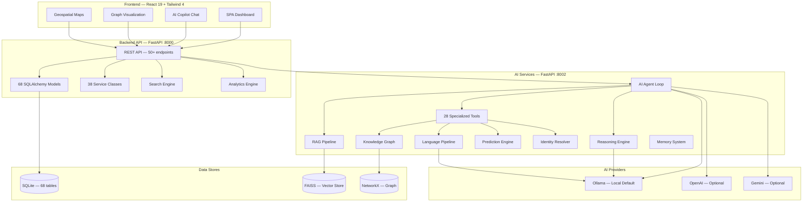
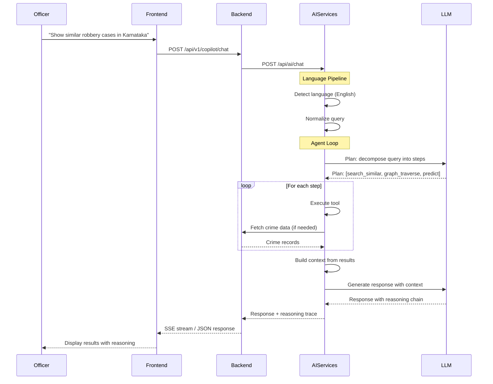
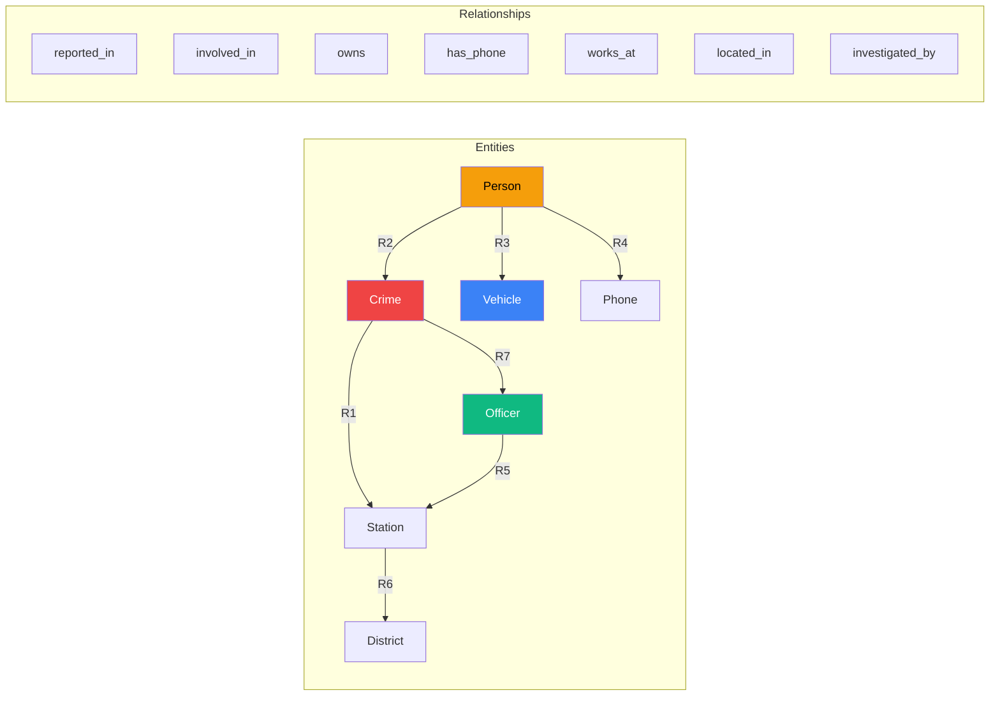
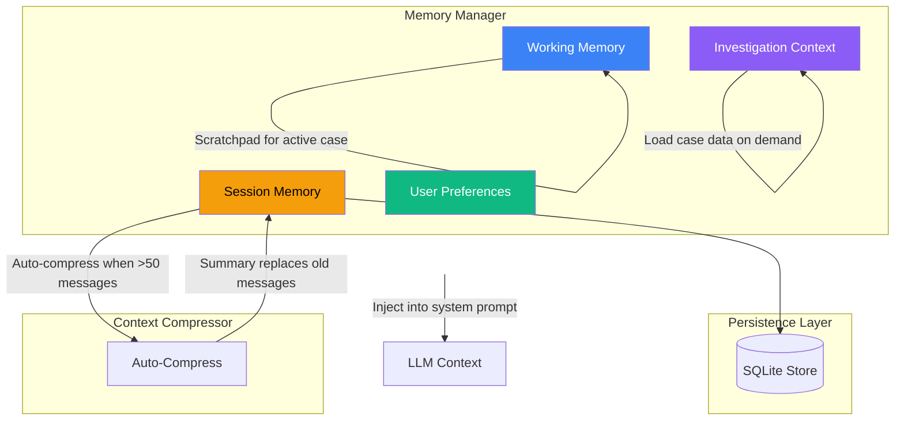
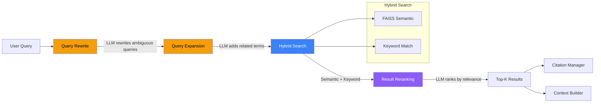
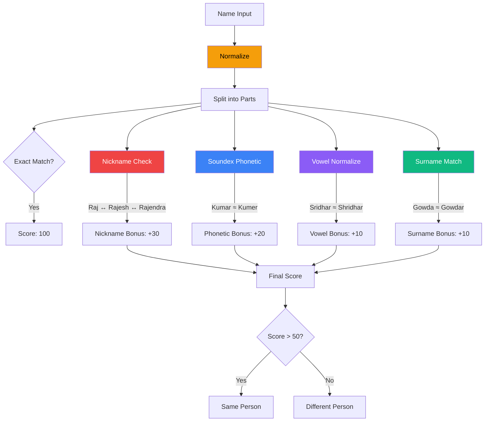
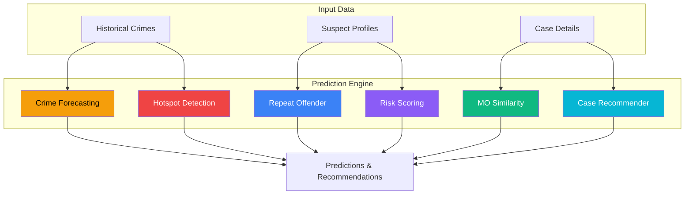
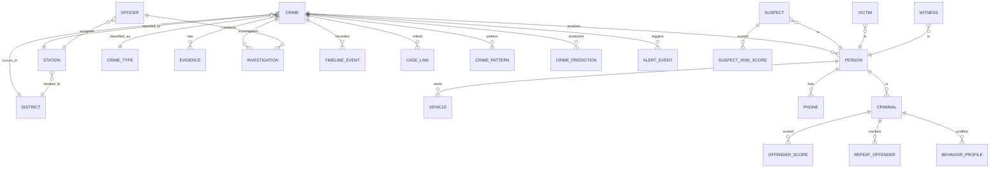

# Architecture

CrimeMatrix is a three-service AI investigation platform designed for the Karnataka State Police. This document covers system design, data flow, and the reasoning behind each architectural choice.

---

## System Overview

---

## Request Flow

How a user query flows through the entire system:

---

## AI Agent Loop

The core of CrimeMatrix is a structured reasoning loop, not a free-form chatbot:

```mermaid
flowchart LR
    Query[User Query] --> Greeting{Is Greeting?}
    Greeting -->|Yes| Respond[Return Greeting]
    Greeting -->|No| Plan[Planner]

    Plan -->|"LLM decomposes into steps"| Steps[Plan Steps]
    Steps --> Execute[Executor]

    Execute -->|"Run each tool"| Tool1[Tool 1]
    Execute --> Tool2[Tool 2]
    Execute --> Tool3[Tool N]

    Tool1 --> Result1[Result 1]
    Tool2 --> Result2[Result 2]
    Tool3 --> ResultN[Result N]

    Result1 --> Build[Context Builder]
    Result2 --> Build
    ResultN --> Build

    Build -->|"Compile results + query"| Context[Structured Context]
    Context --> Respond2[Responder]
    Respond2 -->|"LLM generates answer"| Answer[Final Response]
    Answer --> Memory[Update Memory]
    Answer --> Trace[Reasoning Trace]

    style Plan fill:#f59e0b,color:#000
    style Execute fill:#3b82f6,color:#fff
    style Build fill:#10b981,color:#fff
    style Respond2 fill:#8b5cf6,color:#fff
```

### Why This Design?

- **Deterministic execution** — Tools are called with exact parameters, no hallucinated tool calls
- **Transparent reasoning** — Every step is tracked in a reasoning trace
- **Retry with backoff** — Failed tool calls retry up to 2 times
- **Greeting short-circuit** — Simple greetings skip the entire pipeline

---

## Knowledge Graph

The knowledge graph connects entities across the investigation domain:

### Graph Operations

| Operation | Purpose | Tool |
|-----------|---------|------|
| **Traversal** | Find all entities connected to a node | `graph_traverse` |
| **Shortest Path** | Find connection between two entities | `graph_shortest_path` |
| **Neighbors** | Get direct connections | `graph_neighbors` |
| **Community Detection** | Identify criminal clusters | `link_analysis.communities` |
| **Centrality** | Find key players in network | `link_analysis.centrality` |
| **Hidden Connections** | Discover indirect links | `relationship.find_hidden` |

---

## Memory Architecture

The memory system has four layers, each serving a different purpose:

| Layer | Purpose | Lifetime |
|-------|---------|----------|
| **Session Memory** | Conversation history with auto-compression | Per session |
| **Working Memory** | Short-term scratchpad for active investigation | Per turn |
| **Investigation Context** | Loaded case data for context injection | Per investigation |
| **User Preferences** | Per-user settings and preferences | Persistent |

---

## Search Intelligence Pipeline

CrimeMatrix doesn't just search — it intelligently processes queries:

### Pipeline Stages

1. **Query Rewrite** — LLM rewrites ambiguous or incomplete queries
2. **Query Expansion** — LLM adds related terms and synonyms
3. **Hybrid Search** — Combines FAISS semantic search with keyword matching
4. **Result Reranking** — LLM re-ranks results by relevance to the original query
5. **Citation Tracking** — Sources are tracked per session for accountability

---

## Identity Resolution Engine

The most domain-specific component — solving the fragmented identity problem unique to Indian law enforcement:

### Matching Strategies

| Strategy | Weight | Example |
|----------|--------|---------|
| **Exact match** | 100 | "Rajesh" = "Rajesh" |
| **Nickname** | +30 | "Raj" = "Rajesh" = "Rajendra" |
| **Phonetic (Soundex)** | +20 | "Kumar" ≈ "Kumer" |
| **Vowel normalization** | +10 | "Sridhar" ≈ "Shridhar" |
| **Surname variant** | +10 | "Gowda" ≈ "Gowdar" |
| **Prefix match** | +40 | "Rajesh" starts with "Raj" |

---

## Prediction Engine

Six prediction models working together:

| Model | Purpose | Method |
|-------|---------|--------|
| **Crime Forecasting** | Predict future crime volume | Time-series analysis |
| **Hotspot Detection** | Identify high-risk areas | Geographic clustering |
| **Repeat Offender** | Predict recidivism | Profile-based scoring |
| **Risk Scoring** | Assess suspect risk level | Multi-factor analysis |
| **MO Similarity** | Compare modus operandi | Behavioral fingerprinting |
| **Case Recommender** | Prioritize investigations | Multi-criteria scoring |

---

## Data Model

The database has 68 models organized into seven entity groups:

### Entity Groups

| Group | Models | Purpose |
|-------|--------|---------|
| **Core** | Crime, Person, Criminal, Victim, Witness, Suspect | People and events |
| **Geography** | District, Station, Location | Spatial context |
| **Investigation** | Investigation, Evidence, Report, CaseLink, Note, Bookmark | Case management |
| **Intelligence** | CrimePattern, PatternCluster, MoProfile, BehaviorProfile, RepeatOffender | Pattern analysis |
| **Prediction** | CrimePrediction, CrimeForecast, Hotspot, OffenderScore, RiskScoreHistory | Predictive analytics |
| **Knowledge** | GraphMeta, CaseSimilarity, CaseEmbedding, MoEmbedding | AI intelligence |
| **Operations** | Alert, AlertRule, EarlyWarningAlert, Notification, Audit | System operations |
